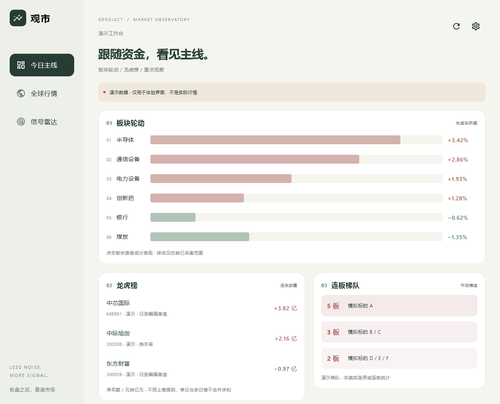

# 观市 · GprojectApp

Kotlin + Compose Multiplatform + Jetpack ViewModel / MVVM 的 Android、Windows 双端收盘观察应用。

前端独立仓库：https://github.com/whath/GprojectApp 。后端保留在 https://github.com/whath/GprojectBack 。

后台开发交接清单：[前端所需接口与业务逻辑](docs/BACKEND_REQUIREMENTS.md)。文档区分当前已调用接口、后台待实现契约及需要双端开发的后续功能。

## 运行

需要 JDK 17、Android SDK 35。Android Studio 打开本目录，配置 `local.properties` 中的 `sdk.dir`，或设置 `ANDROID_HOME`。Windows 执行：

```powershell
./gradlew.bat :app:run
./gradlew.bat :app:assembleDebug
./gradlew.bat :app:desktopTest
./gradlew.bat :app:createDistributable
```

- APK：`app/build/outputs/apk/debug/app-debug.apk`，开发签名，用于内测，不是应用商店发行包。
- Windows：`app/build/compose/binaries/main/app/Gproject/Gproject.exe`。必须保留同目录 app/runtime 文件夹；完整目录可复制部署，无需另装 Java。
- MSI：Windows 执行 `:app:packageMsi`，Compose 插件准备 WiX；输出 `app/build/compose/binaries/main/msi/Gproject-1.0.0.msi`。仅当前用户安装，默认路径 `%LOCALAPPDATA%\Gproject`，未配置发行签名。
- GitHub Actions 每次推送 main 构建 Android APK、Windows 完整目录、MSI 及界面预览并上传构建产物；工作流运行成功后可在 Actions 下载。

## 四个 Tab

1. **今日主线**：行业排行、逐条龙虎榜、连板梯队、重点板块资金与成分表现。点击行业或板块标签切换重点观察。
2. **全球行情**：美股观察池和纽约金主连、布伦特原油；日经、韩国综合；A 股银行、大盘、创业板、科创 50。
3. **信号雷达**：顶部风险、下跌趋势、回调横盘、放量突破、底部反转五组预设，提供参数、命中依据、确认与失效条件；自定义模式保留 MA3/5/8/12/15/20/125、Wilder RSI14、量比与突破的 AND 筛选。
4. **观察池**：从筛选结果手动加入，支持移出和置顶、本地保存；同步个股、所属同花顺行业走势与近 5/10/20 日资金变化。大模型 API 预留入口也位于这里与连接设置中。

暖白背景、深墨绿文字、低饱和砖红上涨 / 鼠尾草绿下跌。900dp 以上左侧导航与双列内容，手机底部导航。默认空状态，需主动选择演示或连接，模拟数据始终带演示提示。

## 连接与数据边界

设置内填写 HTTPS API 根地址和 Bearer token。令牌只保存在内存，不写入磁盘、日志、构建产物或 Git。HTTP 和自动重定向关闭；服务端需可信证书。服务公网入口未启用时不能在手机上直接连接，客户端不会擅自开启后端公网访问。

**已经对接**：行业排行、龙虎榜、美股配置观察池、板块当日成分快照与日线、A 股已登记标的和日线筛选。日期、来源、缺失状态显示在界面；真实请求失败不降级成演示数据。

**后端尚不支持**：资金流、重点事件、连板规则与梯队、金油主连、日韩指数及 A 股指数接口。生产模式显示“待接入”，不以成交额充当资金流、不用 ETF 价格充当指数。演示只用于产品与交互验收。完整同花顺成分仍取决于后端供给，缺失时不跨来源替代。

筛选通过每页 500 条的分页读取全部已登记 A 股，不再限制前 30 只；每只读取最多 250 根不复权日线，最多 4 个行情请求并行。界面显示总数、进度、有效和缺失/失败数，可停止扫描，部分结果明确标识。完整交易所范围仍取决于后端目录与采集覆盖，不把扫描完现有目录等同于全部上市公司数据齐全。仅最新日期等于服务目标交易日、单一来源、有足够数据的标的参与计算。窗口是实际观测日线，不自动补交易日；缺日及除权分红可能影响指标。观察池独立于扫描范围，重新筛选不会自动增删观察池。资金、事件与观察池支持应用内每 5 分钟更新，没有后台推送。

API 凭证、筛选参数与详情选择在当前会话内有效；监控开关、关注板块、5/10/20 日窗口、已读事件版本、个股观察池与置顶状态本地保存。国内模型入口支持服务标记、HTTPS 根地址、模型/部署 ID 与仅内存 API Key；本版只预留分析接口，尚不调用模型。演示操作不覆盖真实设置。详见 [观察池与模型扩展说明](docs/WATCH_POOL_AI.md)。

## 资金监控、重点事件与技术组合

- 板块详情优先展示近 5／10／20 个交易日资金柱图、累计净额和逐日流入／流出。关注板块连续至少 3 个已观测交易日净流出时，在应用首页提醒；缺数和历史快照单独标识。
- 全球行情的美股、日本、韩国、黄金和原油各自展示关联事件，可查看出处、发布时间、发生时间和标记已读。过期条目自动过滤，同一事件跨市场共享已读状态。
- 应用内每 5 分钟刷新，可暂停或手动更新；Android 进入后台暂停，恢复前台刷新。没有关闭 App 后的推送。
- 技术组合以蜡烛形态、趋势、支撑阻力和量能为参考，输出观察与确认条件，不预判必然主升。具体口径见 [技术规则](docs/TECHNICAL_RULES.md)。
- **真实资金和事件仍待服务端接入**，客户端接口和状态处理已实现。字段、数据校验与对接步骤见 [监控接口约定](docs/INTELLIGENCE_API.md)。

## 板块与个股详情

- 点击首页板块进入独立详情。Windows 左侧列出可切换板块，手机顶部使用横向板块标签；成分列表可继续进入个股详情，返回保留所选板块。
- 龙虎榜支持“查看全部”与逐条点击个股，个股页保留所选披露的上榜原因和净买额。
- 个股支持分时、日K、周K、月K切换，日均线采用 MA3/5/8/12/15/20/125，周／月均线采用对应周期 MA5/10/20；提供成交量、点选 OHLC、缩放及历史滑块。Android 系统返回逐级返回详情来源。
- K 线采用统一价格刻度、右侧价格轴、价量对齐的十字线和当前选中收盘标签。点击或横向拖动查看 OHLC、周期涨跌与均线数值；均线可隐藏，支持历史翻页、回到最新和专注图表模式。均线参与可视价格范围计算，避免出界裁切；缺失成交量用点标记，不补为零。
- 日均线统一 MA3/5/8/12/15/20/125，可逐条显隐。MACD(12,26,9) 和个股主力资金副图与 K 线同步选日和历史范围；周/月指标按对应周期计算，资金缺日不汇总。真实个股资金等待后端实现 [可选接口](docs/STOCK_FUNDS.md)，演示数据明确标为模拟。
- 真实日线来自 `/v1/bars/{instrument_id}?limit=2000&end=目标日期`，使用不复权 OHLC。周线以周一为起点，月线按自然月聚合，首尾周期及有缺失交易日的周期不保证完整。不同来源不能混合，缺失成交量不补为零，成交量保留股／手口径。
- 分时后端尚未提供，真实模式展示待接入，演示模式提供明确标记的模拟分钟走势。常规数据展示开高低收、前次观测收盘、成交量、成交额；换手率、总市值、市盈率暂无接口，显示缺失状态。

## 结构

```text
app/src/commonMain/kotlin/cn/gproject/
  App.kt       Compose 界面与响应式布局
  Market.kt    数据模型、Repository、ViewModel、指标算法、独立演示数据
app/src/androidMain/    Android Activity、OkHttp 引擎
app/src/desktopMain/    桌面窗口、CIO 引擎
app/src/commonTest/     指标边界与数值格式测试
app/src/desktopTest/    接口合约、双尺寸渲染与交互测试
```

View → StateFlow → Jetpack ViewModel → Repository → 现有只读 API。切换连接、演示和筛选时取消旧任务，关闭 ViewModel 清理客户端。

版本选型参考 [Compose 1.8.2 官方说明](https://kotlinlang.org/docs/multiplatform/whats-new-compose-180.html) 与 [Compose 兼容说明](https://kotlinlang.org/docs/multiplatform/compose-compatibility-and-versioning.html)。锁定 Kotlin 2.1.20、Compose 1.8.2、AGP 8.7.3、Gradle 8.14，不使用动态版本。

## 界面预览（演示数据）



手机界面：[今日主线](docs/screenshots/phone-today.png) · [全球行情](docs/screenshots/phone-global.png) · [信号雷达](docs/screenshots/phone-signals.png) · [技术筛选](docs/screenshots/phone-filters.png)。

详细测试范围与未完成边界见 [验收记录](docs/VALIDATION.md)。
